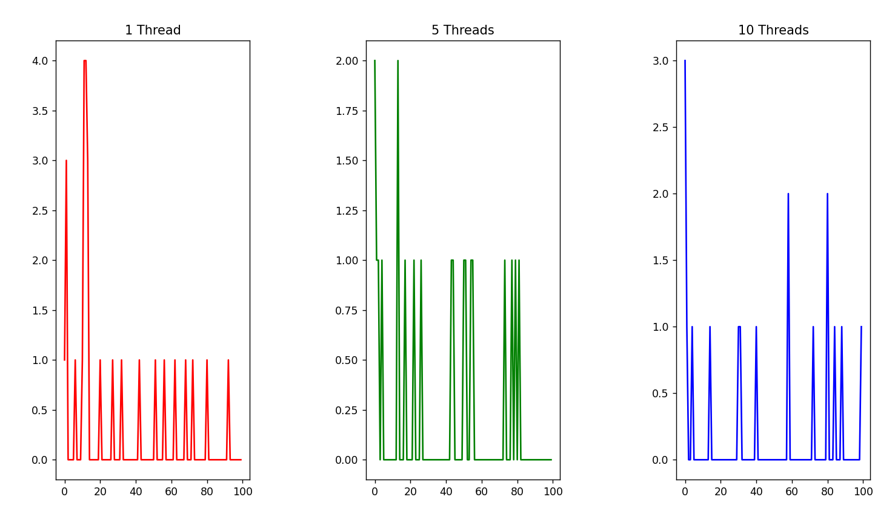

# Primal Numbers Verifier with Parallel Programming

**Docente:**

- Edson Mota

**Discentes:**

- Felipe Ribeiro
- Guilherme Almeida

**Linguagens:**

- Java (execução das Threads)
- Python (geração de gráficos)

## Passo a passo

1. Executar o arquivo Main.java
2. Executar o arquivo MainFiveThreads.java
3. Executar o arquivo MainTenThreads.java
4. Executar o arquivo graphs.py

## Resultado

Foram separadas 100 amostras dos resultados para análise gráfica.



A partir da análise dos gráficos, é possível perceber como na maioria dos casos, o cenário de 5
Threads obteve um resultado melhor em termos de tempo de execução, chegando a no máximo 2 milissegundos,
enquanto o de 1 Thread chegou a um máximo de 4 milissegundos. O cenário intermediário foi o de 10
Threads, chegando a um máximo de 3 milissegundos.

## Análise

Os códigos seguiram por uma única via de executar as Threads. Porém, havendo mais de
uma thread (como de 5 e 10), é utilizada uma ArrayList para definir e alocar as Threads.

O processo principal, contudo, é o mesmo.

Leitura do arquivo com todos os números e definitção do `PrintWriter`:

```java
    Scanner scanner = new Scanner(new File('local/do/arquivo.txt'));
    PrintWriter writer = new PrintWriter(output);
```

Algorítmo de números primos:

```java
public static Boolean primalVerifier(Integer number) {
    if (number > 0 && number <= 2) return true;

    for (int i=2; i<= Math.sqrt(number); i++) {
        if (number % i == 0) return false;
    }
    return true;
}
```

Algorítmo sendo executado dentro da Thread:

```java
Thread task = new Thread(() -> {
    long startTime = System.currentTimeMillis();
    if (ImportantFunctions.primalVerifier(formattedLineNumber)) {
        primals.add(formattedLineNumber);
        writer.println(formattedLineNumber);
        long endTime = System.currentTimeMillis();
        long tempoExecucao = endTime - startTime;
        tempWriter.println(tempoExecucao);
    }
});
```

Após os números primos serem adicionados à ArrayList `primals`, eles são alocados
em um novo arquivo de texto com o auxílio do `PrintWriter`.

Caso haja uma Thread, o seguinte bloco de código é executado:

```java
tasks.add(linesReaded % TOTAL_THREADS, task);
linesReaded++;
task.start(); // A Thread é iniciada aqui
```

Caso haja mais de uma Thread, o seguinte bloco de código é executado:

```java
tasks.add(linesReaded % TOTAL_THREADS, task);
linesReaded++;
task.start(); // As Threads são iniciadas aqui

if (linesReaded % TOTAL_THREADS == 0 || !scanner.hasNextLine()) {
    for (int i = 0; i < linesReaded % TOTAL_THREADS; i++) {
        try {
            tasks.get(i).join();
        } catch (InterruptedException e) {
            System.out.println(e.getMessage());
        }
    }
}
```
